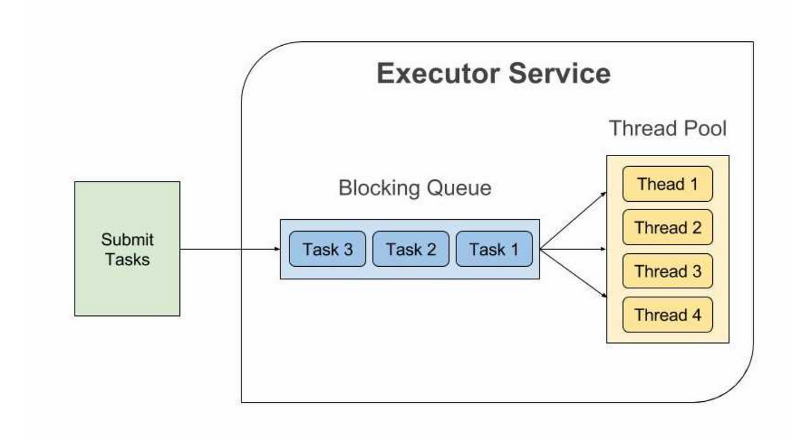

# Executor Service

Java Executor Service nos simplifica las tareas asincronas proveyendo un pool de hilos que son manejados por esta  API abstrayendonos del trabajo de crearlos y asignarles tareas a estos hilos.

## ExecutorService vs Fork/Join

Tras el lanzamiento de Java 7, muchos desarrolladores decidieron reemplazar el framework ExecutorService por el framework fork/join.

Sin embargo, esta no siempre es la decisión correcta. A pesar de la simplicidad y las frecuentes mejoras de rendimiento asociadas con fork/join, reduce el control del desarrollador sobre la ejecución simultánea.

ExecutorService le brinda al desarrollador la capacidad de controlar la cantidad de subprocesos generados y la granularidad de las tareas que deben ejecutarse por subprocesos separados. El mejor caso de uso para ExecutorService es el procesamiento de tareas independientes, como transacciones o solicitudes según el esquema "un subproceso para una tarea".

En cambio, según la documentación de Oracle, fork/join fue diseñado para acelerar el trabajo que se puede dividir en partes más pequeñas de forma recursiva.

## ScheduledExecutorService

Sirve para poder programar el tiempo cuándo realizar una tarea:

- schedule: empieza a ejecutar la tarea tras un tiempo determinado.
- scheduleAtFixedRate: lanza secuencialmente la misma tarea cada intervalo de tiempo definido. Es independiente de lo que la tarea tarde en acabarse. También se puede definir un delay inicial.
- scheduleWithFixedDelay: lanza secuencialmente la misma tarea cada intervalo de tiempo definido una vez acabada la instancia previa. Espera a que una tarea se acabe para comenzar el intervalo de espera e iniciar la siguiente. También se puede definir un delay inicial.

## Types Of Executors

Proporciona varios métodos de fábrica que pueden crear distintos tipos de Executors. Algunos de los Executors más utilizados son:

- newCachedThreadPool(): variable, crea tantos hilos nuevos como sea necesario, reutilizando los ya creados a medida que quedan libres y destruyendo los que están un tiempo sin actividad (ThreadPoolExecutor).
- newFixedThreadPool(n): fijado por el usuario (ThreadPoolExecutor).
- newSingleThreadExecutor(): fijado a 1 (ThreadPoolExecutor).
- newWorkStealingPool(): según el número de procesadores lógicos disponibles (ForkJoinPool).
- newScheduledThreadPool(n): fijado por el usuario (ScheduledThreadPoolExecutor).
- commonPool(): según el número de procesadores lógicos disponibles menos 1 (ForkJoinPool).

Desde código podemos conocer el número de procesadores lógicos disponibles mediante "Runtime.getRuntime().availableProcessors()".
